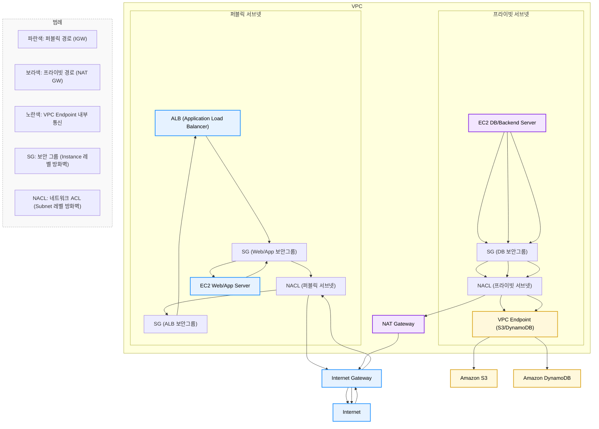

# 목차
- [이번주의 주요 서비스](#이번주의-주요-서비스)
  - [Amazon Relational Database Service (RDS)](#amazon-relational-database-service-rds)
  - [Amazon Aurora (RDS Aurora)](#amazon-aurora-rds-aurora)
  - [Amazon Virtual Private Cloud (VPC)](#amazon-virtual-private-cloud-vpc)
  - [Amazon ElastiCache](#amazon-elasticache)
  - [Amazon RDS Proxy](#amazon-rds-proxy)
- [서비스 요약 표](#서비스-요약-표)
- [자주 물어보는 내용](#자주-물어보는-내용)
  - [Database 성능 저하](#database-성능-저하)
    - [읽기 성능 저하](#읽기-성능-저하)
    - [쓰기 성능 저하](#쓰기-성능-저하)
  - [네트워크 기본 구성](#네트워크-기본-구성)
  - [Endpoint를 사용하면 저렴하고안전하다](#endpoint를-사용하면-저렴하고안전하다)

---

# 이번주의 주요 서비스

## Amazon Relational Database Service (RDS)
[관리가 용이한 관계형 데이터베이스는 총소유비용에 최적화](https://aws.amazon.com/ko/rds/)

- 관리형 관계형 데이터베이스 서비스
- MySQL, PostgreSQL, MariaDB, Oracle, SQL Server 지원
- 자동 백업, 패치, 장애 조치 제공

---

## Amazon Aurora (RDS AURORA)
[PostgreSQL, MySQL 및 DSQL에 대해 비할 데 없는 고성능과 고가용성을 글로벌 규모로 제공하는 서비스](https://aws.amazon.com/ko/rds/aurora/)

- 클라우드 네이티브 DB, MySQL/PostgreSQL 호환
- 상용 DB 수준의 성능과 안정성
- Aurora Serverless 옵션 제공 (자동 확장)

---

## Amazon Virtual Private Cloud (VPC)
[논리적으로 격리된 가상 네트워크에서 AWS 리소스를 정의하고 시작](https://aws.amazon.com/ko/vpc/)

- 퍼블릭/프라이빗 서브넷 구성 가능
- 보안 그룹(Security Group), 네트워크 ACL(NACL), 라우팅으로 네트워크 제어
- VPN, Direct Connect 연동 가능
- **Internet Gateway (IGW)**  
  - VPC를 인터넷과 연결하는 관문 역할  
  - 퍼블릭 서브넷에 있는 EC2 인스턴스가 외부 인터넷과 통신 가능  
- **NAT Gateway / NAT Instance**  
  - 프라이빗 서브넷의 인스턴스가 인터넷으로 **아웃바운드 트래픽**을 보낼 수 있도록 중계  
  - 외부에서 해당 인스턴스로 **인바운드 접속은 차단**  
- **VPC Endpoints**  
  - S3, DynamoDB 등 AWS 서비스에 인터넷 경유 없이 내부 전용 연결 제공  
  - 데이터 전송 비용 절감, 보안성 강화  
- **VPC Peering / Transit Gateway**  
  - 여러 VPC 간 통신 가능  
  - 다수 VPC를 허브-스포크 방식으로 연결할 때 Transit Gateway 활용  

---

## Amazon ElastiCache
[Valkey, Memcached 및 Redis OSS 호환성과 함께 마이크로초 지연 시간을 제공하는 서버리스 완전 관리형 캐싱 서비스](https://aws.amazon.com/ko/elasticache/)

- Redis, Memcached 호환 인메모리 캐시
- DB 부하 감소, 빠른 응답 속도
- 세션 관리, 캐싱, 순위표 등에 활용

---

## Amazon RDS Proxy
[애플리케이션의 확장성, 복원력, 보안 강화](https://aws.amazon.com/ko/rds/proxy/)

- RDS/Aurora 전용 데이터베이스 연결 풀링 서비스
- 장애 조치 시 자동 연결 관리
- IAM 인증 통합 → 보안 강화

---

# 자주 물어보는 내용

## Database 성능저하
- 데이터베이스 성능 저하는 크게 **읽기(Read) 성능 저하**, **쓰기(Write) 성능 저하**, **연결(Connection) 성능 저하**, 그리고 **고가용성(High Availability) 확보**라는 네 가지 관점에서 접근할 수 있다.

### 읽기 성능 저하
> **어떻게 완화할 수 있는가**

**RDS의 경우**
- **읽기 전용 복제본(Read Replica)** → 보고서/검색 트래픽 분리
- **ElastiCache(캐시)** → 자주 조회하는 데이터 캐싱
- 애플리케이션 단 캐싱 전략 필요
- ⚠️ **Multi-AZ 배포는 읽기 성능 확장 용도가 아님** (장애 복구 전용)

**Aurora의 경우**
- **Aurora Read Replica** (최대 15개) → 대규모 읽기 분산
- **Aurora Reader Endpoint** → 읽기 트래픽 자동 분산
- **Aurora Global Database** → 리전 간 읽기 지연 최소화
- 기본 Multi-AZ 구조(6중 복제)로 고가용성 내장

---

### 쓰기 성능 저하
> **어떻게 완화할 수 있는가**

**RDS의 경우**
- 인스턴스 스펙 업그레이드 (Vertical Scaling)
- 샤딩(Sharding), 테이블 파티셔닝
- 병렬 처리 구조 설계
- Multi-AZ는 **쓰기 성능 향상에는 기여하지 않음**, 다만 장애 시 Failover로 가용성 유지

**Aurora의 경우**
- **분산 스토리지(6중 복제)** → 높은 쓰기 처리량
- **자동 스토리지 확장** (최대 128TB)
- Aurora Serverless v2 → 트래픽 변화에 따라 자동 확장
- 필요 시 애플리케이션 레벨 샤딩 병행

---

### 연결 성능 저하 (Connection Overload)
> **어떻게 완화할 수 있는가**

**공통**
- **RDS Proxy** 도입  
  - DB 연결 풀링(Connection Pooling) 제공  
  - Lambda 같은 서버리스 환경에서 연결 폭증 방지  
  - 장애 조치 시 자동 연결 전환 → 다운타임 최소화  

---

### 고가용성(High Availability, HA)
> **DB가 장애나 AZ(가용 영역) 장애에도 중단 없이 동작하게 하는 설정**

**RDS의 경우**
- **Multi-AZ 배포**:  
  - 하나의 프라이머리 + 하나의 스탠바이 인스턴스 (동기 복제)  
  - 장애 시 자동으로 스탠바이로 Failover  
- **자동 백업 및 PITR**(Point-In-Time Recovery) → 데이터 복구 가능

**Aurora의 경우**
- **다중 AZ + 다중 노드 구조(6중 복제)**:  
  - 데이터를 3개 AZ에 자동 분산 저장  
  - 노드 장애 시 자동 Failover  
- **Aurora Global Database**:  
  - 여러 리전에 데이터 복제 → 리전 전체 장애에도 복구 가능  
- **Cluster Endpoint / Reader Endpoint**:  
  - 연결 자동 분리 및 Failover 시 자동 재분배

## 네트워크 기본 구성

> **퍼블릭망 통신을 위한 구성물**
- 인터넷 게이트웨이 (IGW)
- 퍼블릭 서브넷
- NAT 게이트웨이 (프라이빗 → 퍼블릭 접근)
  - NAT 인스턴스는 더이상 사용되지않는다. 관리형(Managed) 서비스가 아니기에 권장X

> **프라이빗망 통신을 위한 구성물**
- VPC 자체의 프라이빗 서브넷
- VPC 엔드포인트 (S3, DynamoDB 등 직접 통신)
- 보안 그룹, NACL(Network Access Control List) 설정

---

## Endpoint를 사용하면 저렴하고/안전하다

- **VPC 엔드포인트**
  - S3, DynamoDB 같은 서비스와 사설망에서 직접 연결
  - 데이터 전송 비용 절감, 인터넷 노출 차단

- **S3 게이트웨이 엔드포인트**
  - S3 전용, 대용량 트래픽 시 저렴하고 안전

- **인터페이스 엔드포인트 (AWS PrivateLink)**
  - EC2, Lambda 등에서 AWS 서비스 또는 SaaS 애플리케이션과 사설망 연결
  - 보안 강화, 인터넷 트래픽 최소화
