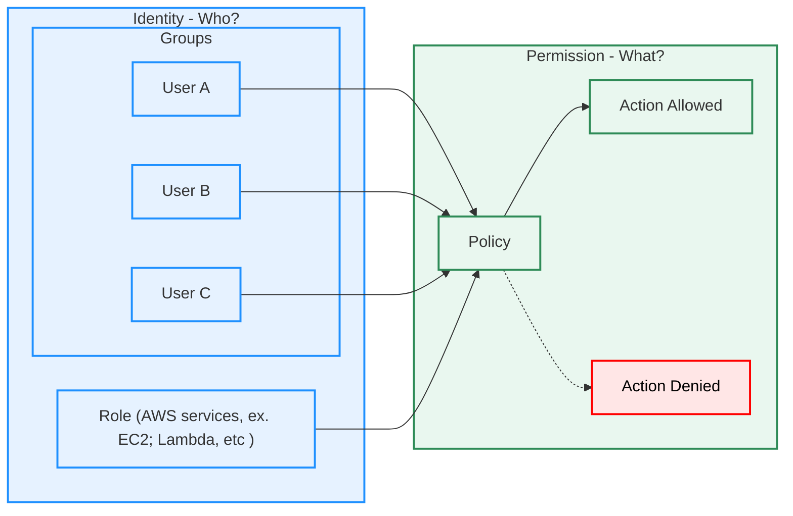

# 목차
- [이번주의 주요 서비스](#이번주의-주요-서비스)
  - [AWS Identity and Access Management (IAM)](#aws-identity-and-access-management-iam)
  - [AWS Key Management Service (KMS)](#aws-key-management-service-kms)
  - [AWS Secrets Manager](#aws-secrets-manager)
  - [AWS Systems Manager Parameter Store](#aws-systems-manager-parameter-store)
- [자주 물어보는 내용](#자주-물어보는-내용)
  - [IAM](#iam)
    - [IAM 작동의 기본 요소](#iam-작동의-기본-요소)
    - [IAM policy 구조](#iam-policy-구조)
  - [KMS 키의 종류](#kms-키의-종류)
  - [Secrets Manager vs Parameter Store](#secrets-manager-vs-parameter-store)

---

# 이번주의 주요 서비스

## AWS Identity and Access Management (IAM)
[AWS 서비스 및 리소스에 대한 액세스와 ID를 안전하게 관리](https://aws.amazon.com/ko/iam/)

- 사용자(User), 그룹(Group), 역할(Role), 정책(Policy)을 통해 권한 제어  
- 최소 권한 원칙 적용 가능 (Least Privilege)  
- 다중 인증(MFA), 임시 자격 증명(STS) 지원  

---

## AWS Key Management Service (KMS)
[데이터를 암호화하거나 디지털 서명할 때 사용하는 키를 생성 및 제어](https://aws.amazon.com/ko/kms/)

- 대칭 키(AES-256)와 비대칭 키(RSA, ECC) 지원  
- AWS 서비스와 네이티브 통합 (S3, EBS, RDS 등)  
- 자동 키 로테이션 지원 (CMK, 1년 주기)  

---

## AWS Secrets Manager
[보안 암호의 수명 주기를 중앙에서 관리](https://aws.amazon.com/ko/secrets-manager/)

- DB 자격 증명, API 키, 토큰 등 민감한 데이터 저장  
- 자동 키 교체(rotate) 지원 (Lambda 기반)  
- IAM 정책과 연계해 접근 제어 가능  
- 사용 시 API 호출 비용 발생  

---

## AWS Systems Manager Parameter Store
[AWS Systems Manager의 도구인 Parameter Store는 구성 데이터 관리 및 비밀 관리를 위한 안전한 계층적 스토리지를 제공](https://docs.aws.amazon.com/ko_kr/systems-manager/latest/userguide/systems-manager-parameter-store.html)

- 구성 값, 환경 변수 저장 가능  
- 일반 파라미터(String) 및 암호화 파라미터(SecureString, KMS 암호화) 지원  
- 비용은 무료 수준이 많음 (고급 파라미터는 유료)  
- 자동 로테이션 기능은 없음  

---

# 자주 물어보는 내용

## IAM

### IAM 작동의 기본 요소
- **사용자(User)**: AWS 계정 내 개별 사용자. 액세스 키(ID, Secret) 혹은 콘솔 로그인 자격 증명 사용  
- **그룹(Group)**: 다수의 사용자에게 동일한 정책 부여  
- **역할(Role)**: 특정 권한 세트를 부여받아 임시로 사용할 수 있는 가상 사용자  
- **정책(Policy)**: JSON 기반 권한 정의. Allow / Deny, Action, Resource, Condition 으로 구성  

https://www.geeksforgeeks.org/devops/identity-and-access-management-iam-in-amazon-web-services-aws/
https://docs.aws.amazon.com/IAM/latest/UserGuide/access_policies_managed-vs-inline.html

- Identity
  - 사람에게 부여되는 User, User Group
  - 도구에 부여되는 Role
- Permission
  - 대상, 행위를 규정하는 Policy

### IAM policy 구조
- Version: 정책 언어 버전 (보통 "2012-10-17")  
- Statement: 실제 권한 정의 블록  
  - Sid: 개별 Statement를 구분하기 위한 선택적 식별자 (Statement ID)
  - Effect: 접근을 허용할지 거부할지 지정, `Allow / Deny` 
  - Principal: 정책이 적용되는 계정이나 사용자 또는 역할 (주체)
  - Action: 허용하거나 거부할 API 동작 목록 (예: s3:PutObject)
  - Resource: 정책이 적용되는 리소스 대상 (예: arn:aws:s3:::bucket-name/*)
  - Condition: 특정 조건에서만 정책이 적용되도록 제한

https://www.google.com/url?sa=i&url=https%3A%2F%2Fmedium.com%2F%40mohasina.clt%2Faws-security-the-basics-of-iam-policies-730c34e0be1a&psig=AOvVaw11skTKuG26deQ-Fj-qjXJA&ust=1759256524012000&source=images&cd=vfe&opi=89978449&ved=0CBgQjhxqFwoTCIiA2bPL_o8DFQAAAAAdAAAAABB0

---

## KMS 키의 종류
- AWS 관리형 키 (AWS Managed Key, aws/service-name): 서비스별 기본 제공, 자동 관리, 사용자 제어 불가  
  - SSE-S3 (Server-Side Encryption with S3 Managed Keys): S3가 자체 관리하는 키, 비용 최소, 사용자 제어 불가  
  - SSE-C (Server-Side Encryption with Customer-Provided Keys): 사용자가 직접 키를 제공, 키 관리 책임은 고객에게 있음  

- 고객 관리형 키 (Customer Managed Key, CMK): 사용자가 생성, 권한 제어 가능, 자동 로테이션 지원(1년)  
  - SSE-KMS (Server-Side Encryption with KMS Keys): AWS KMS를 사용, AWS 관리형 키 또는 CMK 선택 가능, 감사/로테이션 지원  

---

## Secrets Manager vs Parameter Store

| 항목 | Secrets Manager | Parameter Store |
|------|-----------------|-----------------|
| 사용 목적 | 민감 정보(비밀번호, API 키) | 일반 구성 값, 환경 변수 |
| 암호 저장 | 지원 | SecureString(KMS) 가능 |
| 자동 로테이션 | 지원 (Lambda 기반) | 지원 안 함 |
| 비용 | API 호출 및 저장 시 유료 | 기본 파라미터 무료, 고급은 유료 |
| 통합성 | RDS, Redshift 등과 자동 통합 | 단순 구성 값 관리 위주 |